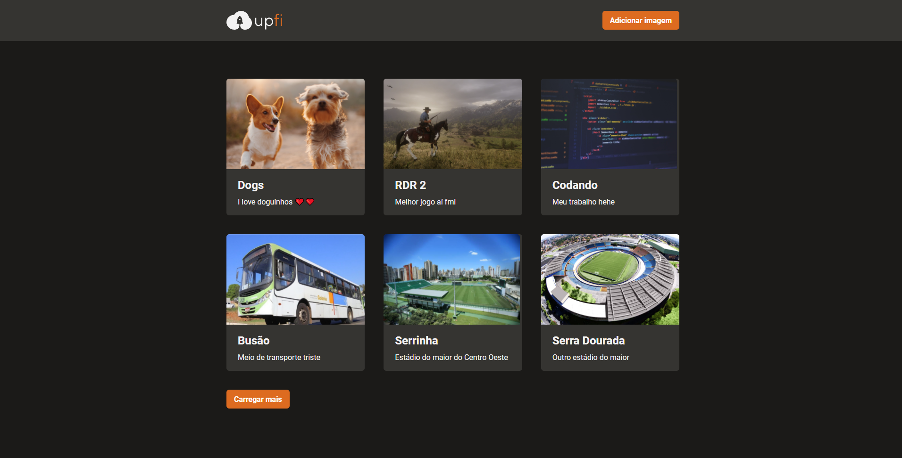

  
  
  

 

  

<h3 align="center">
  Desafio 08 - Trilha ReactJS
</h2>

	Resolução do Desafio "Upload de imagens"

## Sobre o desafio

  

Nesse desafio, você deverá criar uma aplicação para treinar o que aprendeu até agora no ReactJS

Essa será uma aplicação onde o seu principal objetivo é adicionar alguns trechos de código para que a aplicação de upload de imagens funcione corretamente. Você vai receber uma aplicação com muitas funcionalidades e estilizações já implementadas. Ela deve realizar requisições para sua própria API Next.js que vai retornar os dados do FaunaDB (banco de dados) e do ImgBB (serviço de hospedagem de imagens). A interface implementada deve seguir o layout do Figma. Você terá acesso a 4 arquivos para implementar:

- Infinite Queries e Mutations com React Query;
- Envio de formulário com React Hook Form;
- Exibição de Modal e Toast com Chakra UI;
- Entre outros.

## Status do desafio

✅ Completo
